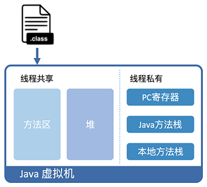
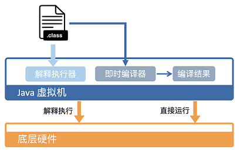

# JVM

## Java程序是如何运行的？

### JVM

编译器将 Java 程序转换成 Java 虚拟机所能识别的指令序列，也称 Java 字节码（Java 字节码指令的操作码（opcode）被固定为一个字节）。相比 C++ 不同的是 Java 版本的编译结果相对精简一些。这是因为 Java 虚拟机相对于物理机而言，抽象程度更高。

```pascal
# 最左列是偏移；中间列是给虚拟机读的机器码；最右列是给人读的代码
0x00:  b2 00 02         getstatic java.lang.System.out
0x03:  12 03            ldc "Hello, World!"
0x05:  b6 00 04         invokevirtual java.io.PrintStream.println
0x08:  b1               return
```

* Java 虚拟机可以由硬件实现，更为常见的是在各个现有平台上提供软件实现，以达到 “**一次编写，到处运行**” 的**可移植性**。
* JVM 带来了一个**托管环境**（Managed Runtime），能够代替我们处理一些代码中冗长而且容易出错的部分，如自动内存管理与GC。托管环境还提供了诸如数组越界、动态类型、安全权限等等的动态检测，使我们免于书写这些无关业务逻辑的代码。


### JVM 是怎样运行 Java 字节码

以标准 JDK 中的 HotSpot 虚拟机为例，从虚拟机以及底层硬件两个角度讲解：

* 从**虚拟机视角**来看，执行 Java 代码首先需要将它编译而成的 **class 文件加载到 Java 虚拟机中**。加载后的 Java 类会被**存放于方法区（Method Area）**中（在1.8以后使用了元空间（meta space）来实现方法区）。实际运行时，虚拟机会执行方法区内的代码。

  类似 X86 段式内存管理中的代码段，JVM也在内存中划分出堆和栈来存储运行时数据。不同的是，Java 虚拟机会将栈细分为面向 Java 方法的 Java **方法栈**，面向本地方法（用 C++ 写的 native 方法）的**本地方法栈**，以及存放各个线程执行位置的 **PC 寄存器**。

  

  在运行过程中，每当**调用**进入一个 **Java 方法**，Java 虚拟机会在**当前线程的 Java 方法栈**中生成一个**栈帧**，用以存放**局部变量**以及**字节码的操作数**。这个栈帧的大小是提前计算好的，而且 Java 虚拟机不要求栈帧在内存空间里连续分布。当**退出**当前执行的方法时，不管是正常返回还是异常返回，Java 虚拟机均会**弹出当前线程的当前栈帧**，并将之舍弃。

* 从**硬件视角**来看，Java 字节码无法直接执行。因此，Java 虚拟机需要将字节码翻译成机器码。在 **HotSpot** 里面，上述翻译过程有两种形式：第一种是**解释执行**，即逐条将字节码翻译成机器码并执行；第二种是**即时编译**（Just-In-Time compilation，**JIT**），即将一个方法中包含的所有字节码编译成机器码后再执行。

  前者的优势在于无需等待编译，而后者的优势在于实际运行速度更快。HotSpot 默认采用混合模式，综合了解释执行和即时编译两者的优点。它会先解释执行字节码，而后将其中反复执行的热点代码，以方法为单位进行即时编译。

  


### JVM的运行效率怎样

HotSpot 采用了多种技术来提升启动性能以及峰值性能，刚刚提到的即时编译便是其中最重要的技术之一。**即时编译建立在**程序符合**二八定律**的假设上，也就是百分之二十的代码占据了百分之八十的计算资源。

对于**占据大部分的不常用的代码**，我们无需耗费时间将其编译成机器码，而是采取**解释执行**的方式运行；另一方面，对于**仅占据小部分的热点代码**，我们则可以将其**编译成机器码**，以达到理想的运行速度。理论上讲，即时编译后的 Java 程序的执行效率，是可能超过 C++ 程序的。这是因为与静态编译相比，即时编译拥有程序的运行时信息，并且能够根据这个信息做出相应的优化。

> 举个例子，我们知道虚方法是用来实现面向对象语言多态性的。对于一个虚方法调用，尽管它有很多个目标方法，但在实际运行过程中它可能只调用其中的一个。这个信息便可以被即时编译器所利用，来规避虚方法调用的开销，从而达到比静态编译的 C++ 程序更高的性能。

为了满足不同用户场景的需要，HotSpot 内置了多个即时编译器：C1、C2 和 Graal。Graal 是 Java 10 正式引入的实验性即时编译器，这里暂不做讨论。之所以引入多个即时编译器，是为了在编译时间和生成代码的执行效率之间进行取舍。

* C1 又叫做 Client 编译器，面向的是对启动性能有要求的客户端 GUI 程序，采用的优化手段相对简单，因此编译时间较短。
* C2 又叫做 Server 编译器，面向的是对峰值性能有要求的服务器端程序，采用的优化手段相对复杂，因此编译时间较长，但同时生成代码的执行效率较高。

从 Java 7 开始，HotSpot 默认采用分层编译的方式：热点方法首先会被 C1 编译，而后热点方法中的热点会进一步被 C2 编译。为了不干扰应用的正常运行，HotSpot 的即时编译是放在额外的编译线程中进行的。HotSpot 会根据 CPU 的数量设置编译线程的数目，并且按 1:2 的比例配置给 C1 及 C2 编译器。在计算资源充足的情况下，字节码的解释执行和即时编译可同时进行。编译完成后的机器码会在下次调用该方法时启用，以替换原本的解释执行。


## Java的基本类型

Java 引进了八个基本类型，来支持数值计算。能够在执行效率以及内存使用两方面提升软件性能。

```java
public class Foo {
  public static void main(String[] args) {
    boolean 吃过饭没 = 2; // 直接编译的话 javac 会报错
    if (吃过饭没) System.out.println(" 吃了 ");
    if (true == 吃过饭没) System.out.println(" 真吃了 ");
  }
}
```

直接编译这段代码，编译器是会报错的。所以采用一个 Java 字节码的汇编工具，直接对字节码进行更改。那么问题就来了：当一个 boolean 变量的值是 2 时，它究竟是 true 还是 false 呢？

跑过这段代码会发现，问虚拟机“吃过饭没”，它会回答“吃了”，而问虚拟机“真（==）吃过饭没”，虚拟机则不会回答“真吃了”。

### JVM 的boolean 类型

在 Java 语言规范中，boolean 类型的值只有两种可能，它们分别用符号“true”和“false”来表示。显然，这两个符号是不能被虚拟机直接使用的。

在 Java 虚拟机规范中，boolean 类型则被映射成 int 类型。具体来说，**“true”被映射为整数 1，而“false”被映射为整数 0**。这个编码规则约束了 Java 字节码的具体实现。即对于存储 boolean 数组的字节码，Java 虚拟机需保证实际存入的值是整数 1 或者 0。Java 虚拟机规范同时也要求 Java 编译器遵守这个编码规则，并且用整数相关的字节码来实现逻辑运算，以及基于 boolean 类型的条件跳转。这样一来，在编译而成的 class 文件中，除了字段和传入参数外，基本看不出 boolean 类型的痕迹了。


## 第三部分 虚拟机执行子系统

## 6 类文件结构


## 7 虚拟机类加载机制

上一节中，在Class文件中描述的各种信息，都需要加载到虚拟机中才能运行和使用。虚拟机把描述类的数据从Class文件加载到内存，并对数据进行校验、转换解析和初始化，最终形成可以被虚拟机直接使用的Java类型，这就是虚拟机的类加载机制。

在Java中，类的加载、连接和初始化过程都是在程序运行期间完成的。虽让类加载时增加性能开销，但是为Java应用提供高度灵活性。

### 类加载时机

类从被加载到虚拟机内存中开始，到卸载出内存为止，整个生命周期包括：加载、连接（验证、准备、解析）、初始化、使用、卸载7个阶段。其中解析可以在初始化阶段之后再开始，这是为了支持Java的运行时绑定（动态绑定）。

JVM规范中并没有强制约束何时“加载”，交由虚拟机实现自由把握。而是严格规定了**有且只有5种情况**必须立即对类进行“初始化”（而加载、验证、准备自然需要在此之前开始）：

1. 遇到 new、getstatic、putstatic 或 invokestatic这4条字节码指令时，如果类没有进行过初始化，则需要先触发其初始化。生成这4条指令的最常见的Java代码场景是：
   - 使用new关键字实例化对象的时候；
   - 读取或设置一个类的静态字段（被final修饰、已在编译期把结果放入常量池的静态字段除外）的时候；
   - 以及调用一个类的静态方法的时候。
2. 使用java.lang.reflect包的方法对类进行反射调用的时候，如果类没有进行过初始化，则需要先触发其初始化。
3. 当初始化一个类的时候，如果发现其父类还没有进行过初始化，则需要先触发其父类的初始化。
4. 当虚拟机启动时，用户需要指定一个要执行的主类（包含main()方法的那个类），虚拟机会先初始化这个主类。
5. 当使用JDK 1.7的动态语言支持时，如果一个java.lang.invoke.MethodHandle实例最后的解析结果REF_getStatic、REF_putStatic、REF_invokeStatic的方法句柄，并且这个方法句柄所对应的类没有进行过初始化，则需要先触发其初始化。

对于这5种会触发类进行初始化的场景，虚拟机规范中使用了一个很强烈的限定语：“有且只有”，这5种场景中的行为称为对一个类进行主动引用。除此之外，所有引用类的方式都不会触发初始化，称为被动引用。下面举3个例子来说明何为被动引用，分别见代码清单7-1～代码清单7-3。